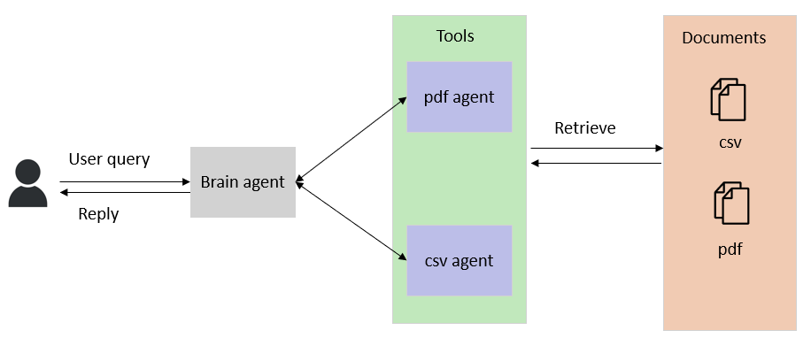
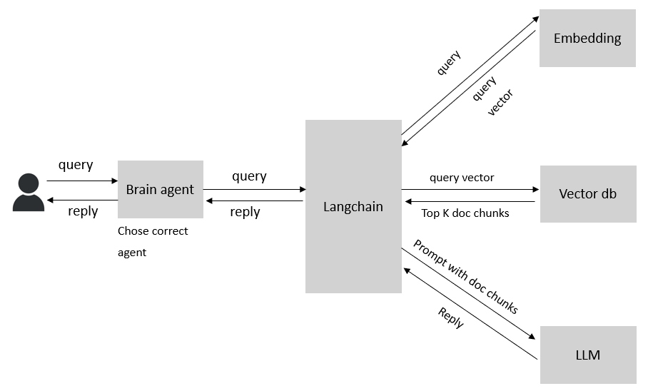
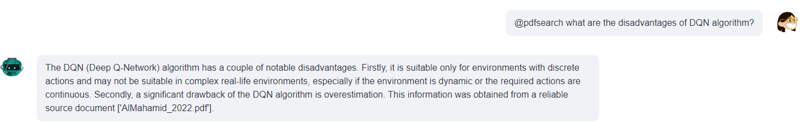
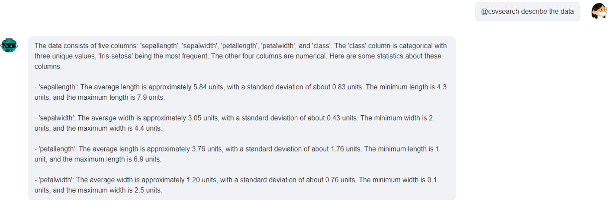
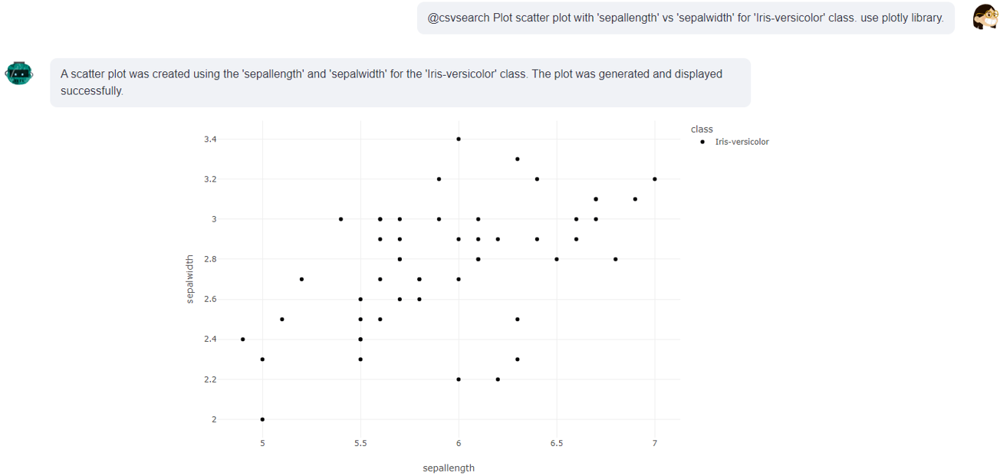

# Chat with your docs!
This project allows you to to talk with your pdf and csv documents through LLMs. In the current version, Azure OpenAI GPT-4 was used. Interracting with documents achieved through creating agents as tools. These agents were created utilizing Langchain framework.



For information retrieval from pdf documents, retrieval augmented generation (RAG) framework was used. The basic architecture is summarized in the figure below.



# Usage
Clone the repository and install the required packages. Add your .env file with these environment variables 
```python
AZURE_OPENAI_API_KEY="your-api-key"
AZURE_OPENAI_ENDPOINT="https://your-end-point.openai.azure.com/"
AZURE_OPENAI_API_VERSION="2023-08-01-preview"
EMBEDDING_MODEL="your-embedding-model-deployment-name"
```

Then run the application via streamlit by running
```python
streamlit run multi_agent_app.py
```
Upload your documents and start asking questions! 
To ask questions about csv and pdf files add @csvsearch and @pdfsearch in the beginning of the question, respectively.
For now only single csv document is supported. However, you can 
upload and get information from multiple pdf files.

## Examples




